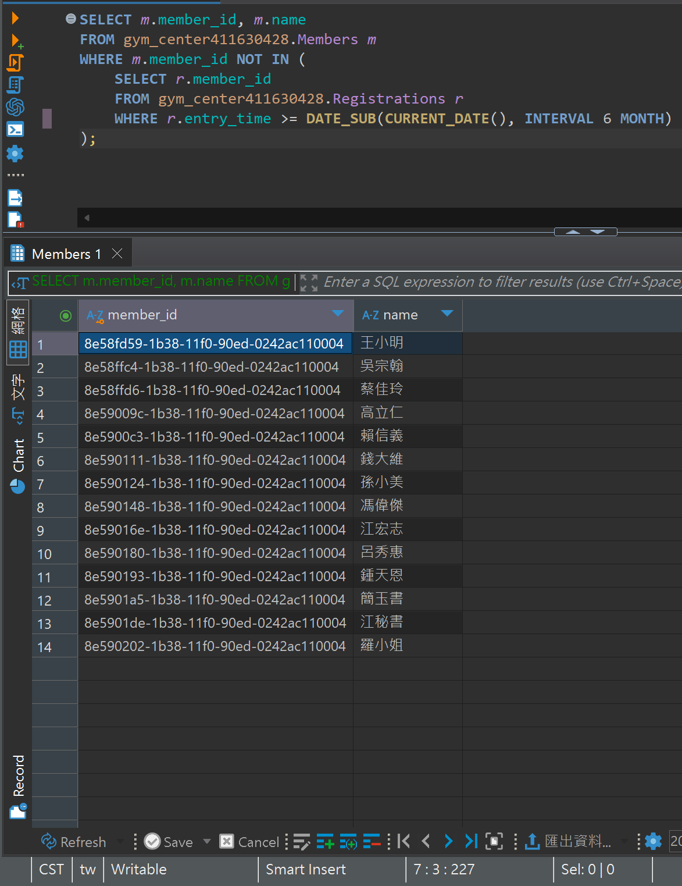

## 題目 1-1

- 列出「過去 6 個月未曾進場過的會員」的 member_id 與 name。
  
    - 可使用三種典型解法：NOT IN、NOT EXISTS、以及 LEFT JOIN ... IS NULL。

    - 觀察並比較這三種方式在執行效率上的表現。

    - 請注意，若資料量很大且表中存在 NULL 值，NOT IN 的結果可能受到干擾而產生不正確的結果。

## 解題過程

- 語法
    ```sql
    SELECT m.member_id, m.name 
    FROM gym_center411630428.Members m
    WHERE m.member_id NOT IN (
        SELECT r.member_id
        FROM gym_center411630428.Registrations r 
        WHERE r.entry_time >= DATE_SUB(CURRENT_DATE(), INTERVAL 6 MONTH)
    );
    ```
- 說明
  - 從 Members.member_id 找到對 Registrations.member_id 的 entry_time
  - `DATE_SUB()`: 用於做日期相減
  - `WHERE r.entry_time >= DATE_SUB(CURRENT_DATE(), INTERVAL 6 MONTH)`: 利用`DATE_SUB()`找出六個月內有登入的人
  - `WHERE m.member_id NOT IN ()`: 找出六個月內沒有登入的人

- 結果
    