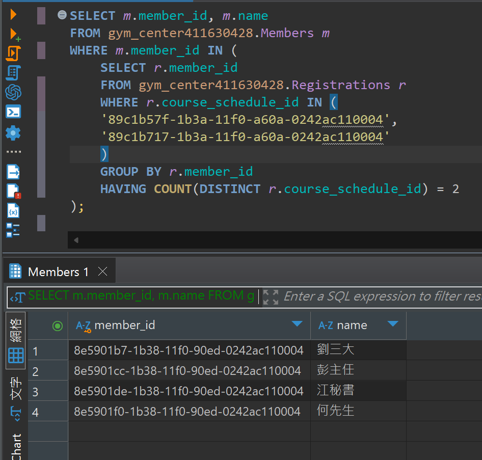

## 題目 1-2

- 列出同時報名過兩個指定時段（假設 course_schedule_id = 'A'、B'）的會員

    - 可以使用集合運算（INTERSECT）、GROUP BY ... HAVING COUNT、或自我聯結 (self join) 等方法。

    - 請比較在不同資料量下，各種解法效率的差異。

## 解題過程
- 語法
    ```sql
    SELECT m.member_id, m.name
    FROM gym_center411630428.Members m
    WHERE m.member_id IN (
        SELECT r.member_id
        FROM gym_center411630428.Registrations r
        WHERE r.course_schedule_id IN ('89c1b57f-1b3a-11f0-a60a-0242ac110004', '89c1b717-1b3a-11f0-a60a-0242ac110004') 
        GROUP BY r.member_id 
        HAVING COUNT(DISTINCT r.course_schedule_id) = 2
    );
    ```
- 說明
  - `GROUP BY r.member_id`: 嘗試將報名紀錄依「會員」分組，接下來只分析每位會員有幾筆報名落在這兩個課程場次
  - `HAVING COUNT(DISTINCT r.course_schedule_id) = 2`: 檢查每位會員，是否同時有報名兩個不同的 course_schedule_id（DISTINCT 很重要，避免同一課重複報名被計算多次）

- 結果
    