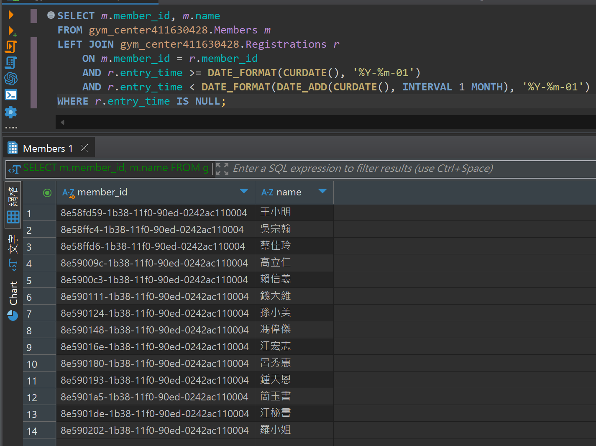

## 題目 2-1

- 找出「本月內沒有任何進場記錄」的會員
    - 分別以 NOT EXISTS、NOT IN、以及 LEFT JOIN ... IS NULL 實現。

    - 使用 EXPLAIN 分析三種寫法的執行計畫，並比較其效能差異。

## 解題過程
- 語法
```sql
SELECT m.member_id, m.name
FROM gym_center411630428.Members m
LEFT JOIN gym_center411630428.Registrations r
    ON m.member_id = r.member_id
    AND r.entry_time >= DATE_FORMAT(CURDATE(), '%Y-%m-01')
    AND r.entry_time < DATE_FORMAT(DATE_ADD(CURDATE(), INTERVAL 1 MONTH), '%Y-%m-01')
WHERE r.entry_time IS NULL;
```
- 說明
  - `LEFT JOIN Registrations r`: 把所有會員都帶進來，並「嘗試」連結上「本月內有進場紀錄」的 Registrations。
  - `AND r.entry_time >= ... AND r.entry_time < ...`: 從本月1號開始，到下個月1號為止
  
- 結果
  