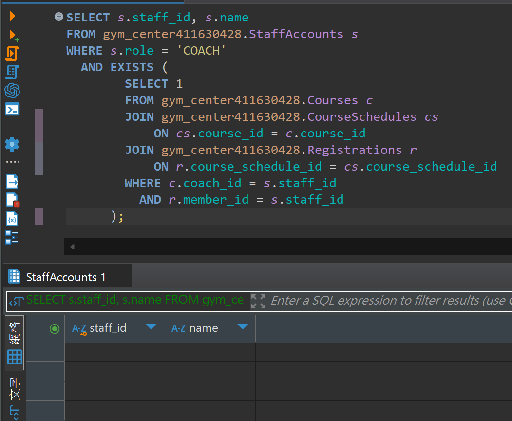

## 題目 2-2

- 列出「至少曾參加自己擔任教練課程」的教練清單

  - 教練必須同時出現在 StaffAccounts，並在 Courses 內綁定為該課程 coach。
  - 他至少有一次以會員身份（在 Members）報名自己所帶的課程 (Registrations)。
  - 請使用 EXISTS 撰寫查詢，需特別留意同一人員在 Members、StaffAccounts 兩表都可能有紀錄。

## 解題過程

- 語法
    ```sql
    SELECT s.staff_id, s.name
    FROM gym_center411630428.StaffAccounts s
    WHERE s.role = 'COACH'
    AND EXISTS (
            SELECT 1
            FROM gym_center411630428.Courses c
            JOIN gym_center411630428.CourseSchedules cs 
                ON cs.course_id = c.course_id
            JOIN gym_center411630428.Registrations r 
                ON r.course_schedule_id = cs.course_schedule_id
            WHERE c.coach_id = s.staff_id
            AND r.member_id = s.staff_id
        );
    ```
- 說明
  - 使用 EXISTS 判斷：是否存在某筆 Courses，其 coach_id 即為該 staff_id
  - 以會員身分報名 Registrations，登記的課程需就是他自己（Courses）教授的那堂課
  
- 結果
