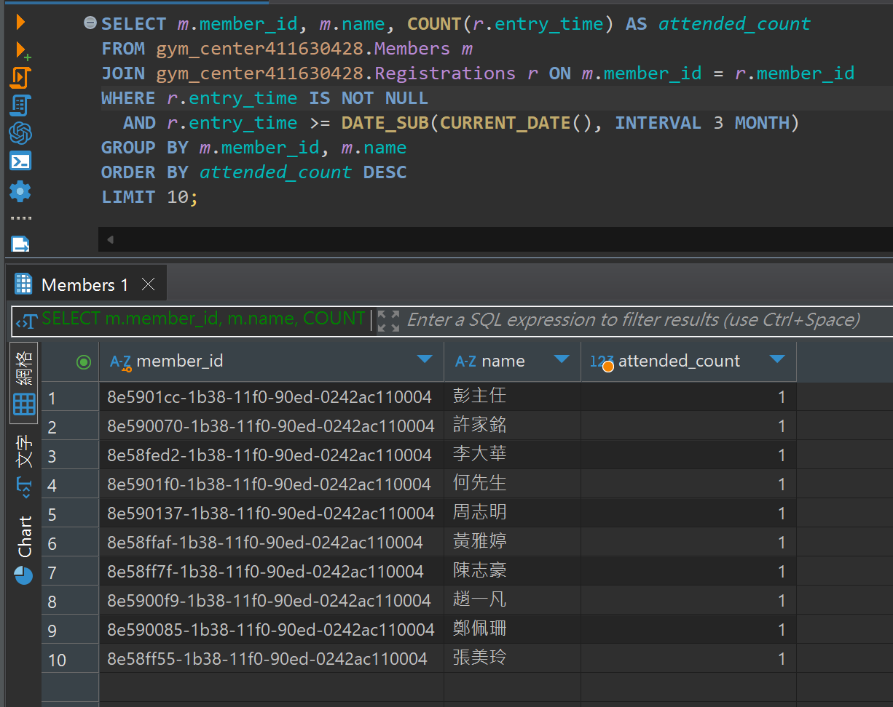

## 題目 3-2

- 找出三個月內報到次數最多的 10 名會員（member_id, name, 出席次數）

    - 請避免不必要的子查詢，儘量以 JOIN 搭配 GROUP BY 完成。
    - 思考有哪些欄位可加索引，以提升此查詢效能。

## 解題過程

- 語法
    ```sql
    SELECT m.member_id, m.name, COUNT(r.entry_time) AS attended_count
    FROM gym_center411630428.Members m
    JOIN gym_center411630428.Registrations r ON m.member_id = r.member_id
    WHERE r.entry_time IS NOT NULL 
    AND r.entry_time >= DATE_SUB(CURRENT_DATE(), INTERVAL 3 MONTH)
    GROUP BY m.member_id, m.name
    ORDER BY attended_count DESC
    LIMIT 10;
    ```
- 說明
  - `GROUP BY m.member_id, m.name`:對每位會員分組，算出每人三個月內報到的總次數。
    
  - `ORDER BY attended_count DESC`:以出席次數由多到少排序。
  - `LIMIT 10`:只取出排名前10的會員。

- 優化語法
  - 效能問題主因在於：

    Registrations 表很大，entry_time 區間與 member_id GROUP BY 缺少索引優化。
    WHERE 條件中 r.entry_time 篩選若無用索引（或索引設計不佳），將發生全表掃描，大量 JOIN 運算負擔。

  - 在 Registrations 表建立複合索引：
    ```sql
    CREATE INDEX idx_entrytime_memberid ON Registrations(entry_time, member_id);
    ```
    ```sql
    CREATE INDEX idx_memberid_entrytime ON Registrations(member_id, entry_time);
    ```
    一般 prioritize 先為 entry_time，因為查詢首先針對日期區間篩選。
    ```sql
    SELECT m.member_id, m.name, stats.attended_count
    FROM gym_center411630428.Members m
    JOIN (
    SELECT member_id, COUNT(*) AS attended_count
    FROM gym_center411630428.Registrations
    WHERE entry_time IS NOT NULL
        AND entry_time >= DATE_SUB(CURRENT_DATE(), INTERVAL 3 MONTH)
    GROUP BY member_id
    ) stats ON m.member_id = stats.member_id
    ORDER BY stats.attended_count DESC
    LIMIT 10;
    ```

- 結果
    