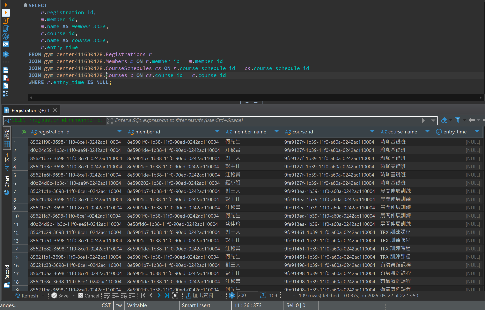

## 題目 4-1

- 查出 entry_time 為 NULL 的報名紀錄，並顯示會員與課程名稱

    - 表示該會員雖然預約了，但尚未實際進場或資料遺漏。
    - 注意 IS NULL 的用法，並透過 JOIN 取出該會員及課程完整資訊。

## 解題過程

- 語法
    ```sql
    SELECT 
        r.registration_id, 
        m.member_id, 
        m.name AS member_name, 
        c.course_id, 
        c.name AS course_name, 
        r.entry_time
    FROM gym_center411630428.Registrations r
    JOIN gym_center411630428.Members m 
        ON r.member_id = m.member_id
    JOIN gym_center411630428.CourseSchedules cs 
        ON r.course_schedule_id = cs.course_schedule_id
    JOIN gym_center411630428.Courses c 
        ON cs.course_id = c.course_id
    WHERE r.entry_time IS NULL;
    ```
- 說明
  - `WHERE r.entry_time IS NULL`: 指出「尚未進場」的紀錄。
- 結果
    