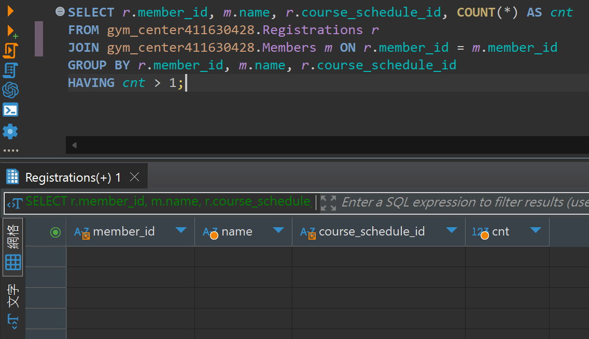

## 題目 4-2

- 檢查同一會員在同一時段報名多次的情況

    - 若資料結構允許重複，找出 member_id, name, course_schedule_id 與「報名次數 (cnt) > 1」的紀錄。
    - 若沒有任何重複，請顯示「無重複資料」。

## 解題過程

- 語法
    ```sql
    SELECT r.member_id, m.name, r.course_schedule_id, COUNT(*) AS cnt
    FROM gym_center411630428.Registrations r
    JOIN gym_center411630428.Members m ON r.member_id = m.member_id
    GROUP BY r.member_id, m.name, r.course_schedule_id
    HAVING cnt > 1;
    ```
- 說明
  - 按照「會員ID+課程時段」分組，統計每個組合的報名紀錄數（cnt）。
  - 若 cnt > 1 則代表同一會員同時段重複報名，結果會列出這類異常紀錄。
  - 查詢結果為空，如本次，代表沒有發生這種重複報名的情況。
- 結果
    