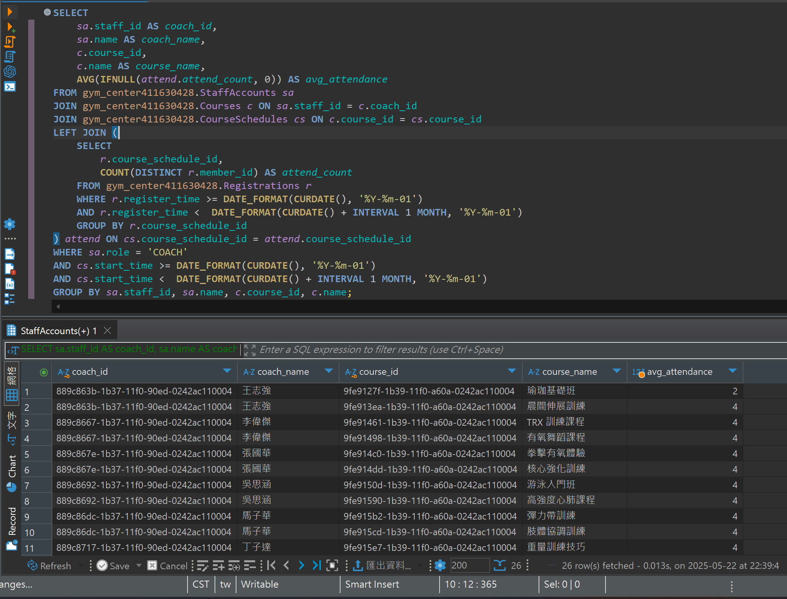

## 題目 5-1

- 列出每位教練「本月」課程所有時段的平均出席人數

    - 請 JOIN StaffAccounts、Courses、CourseSchedules、Registrations，並利用 GROUP BY 教練、課程。
    - 使用 EXPLAIN 分析你的寫法，以觀察在大資料量下的索引使用情況或可能的全表掃描。
    - 思考：可在哪些欄位加索引來優化這個多表 JOIN 與群組運算？

## 解題過程

- 語法
    ```sql
    SELECT 
        sa.staff_id AS coach_id,
        sa.name AS coach_name,
        c.course_id,
        c.name AS course_name,
        AVG(IFNULL(attend.attend_count, 0)) AS avg_attendance
    FROM StaffAccounts sa
    JOIN Courses c ON sa.staff_id = c.coach_id
    JOIN CourseSchedules cs ON c.course_id = cs.course_id
    LEFT JOIN (
        SELECT 
            r.course_schedule_id, 
            COUNT(DISTINCT r.member_id) AS attend_count
        FROM Registrations r
        WHERE r.register_time >= DATE_FORMAT(CURDATE(), '%Y-%m-01')
        AND r.register_time <  DATE_FORMAT(CURDATE() + INTERVAL 1 MONTH, '%Y-%m-01')
        GROUP BY r.course_schedule_id
    ) attend ON cs.course_schedule_id = attend.course_schedule_id
    WHERE sa.role = 'COACH'
    AND cs.start_time >= DATE_FORMAT(CURDATE(), '%Y-%m-01')
    AND cs.start_time <  DATE_FORMAT(CURDATE() + INTERVAL 1 MONTH, '%Y-%m-01')
    GROUP BY sa.staff_id, sa.name, c.course_id, c.name;
    ```
- 說明
  - 

- 優化方向與推薦索引

  - 應針對查詢狀況設下複合索引如下：
    - CourseSchedules: (start_time, course_id)
    - Registrations: (course_schedule_id,register_time, member_id)
  - 用日期區間而非 MONTH()/YEAR()（如下例）來提高索引效能。
    - ALTER TABLE CourseSchedules ADD INDEX idx_time_course (start_time, course_id);
    - ALTER TABLE Registrations ADD INDEX idx_sched_time_mem (course_schedule_id, register_time, member_id);

- 結果
